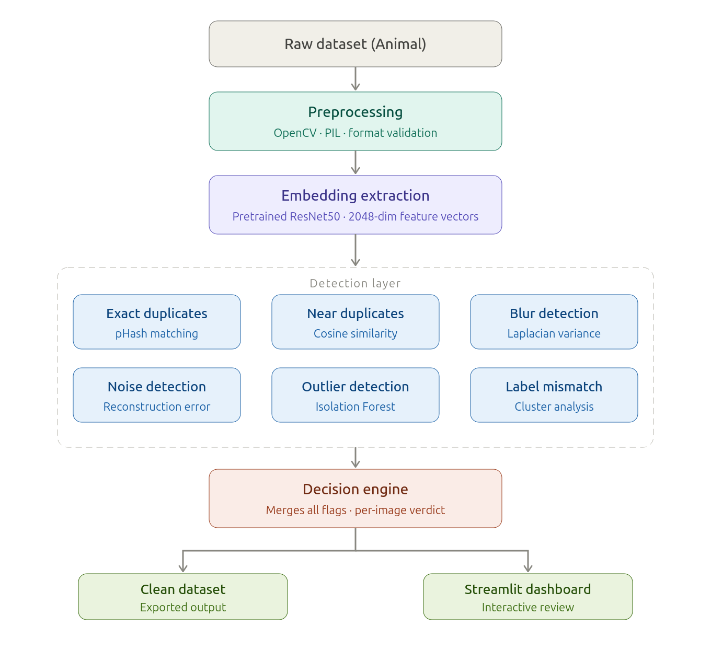
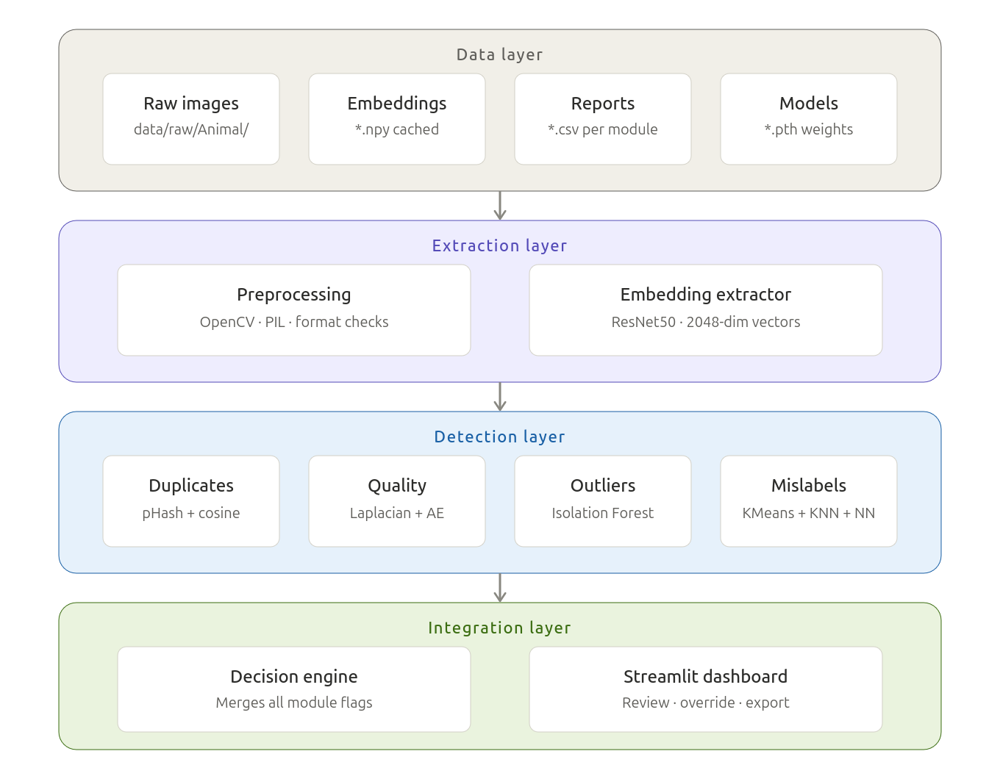
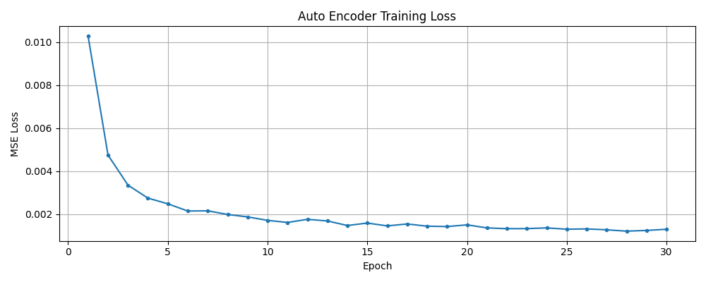
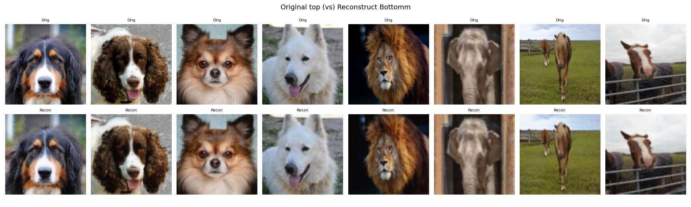
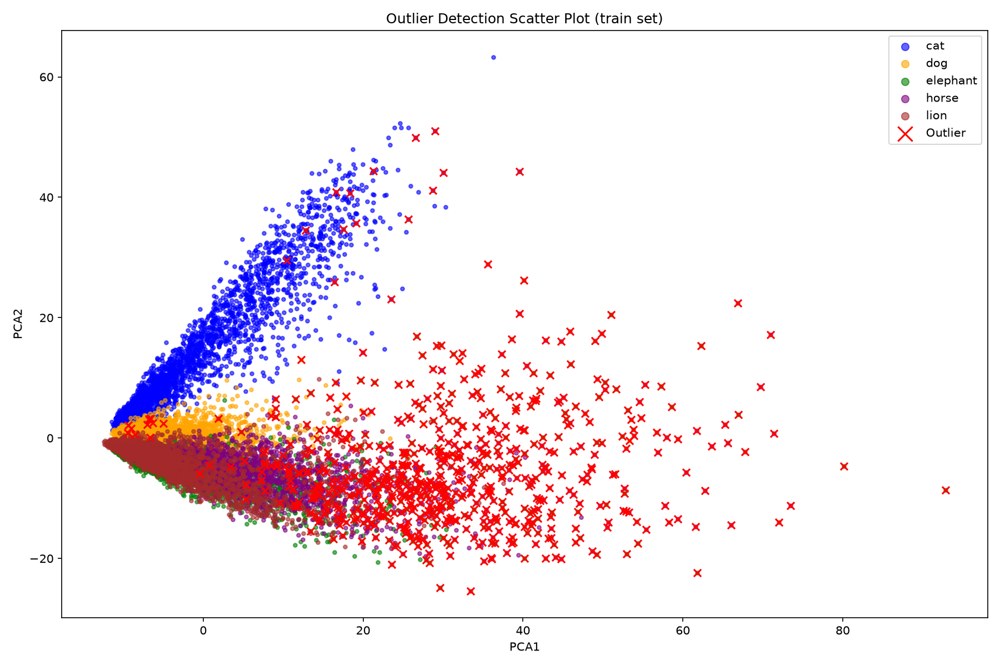
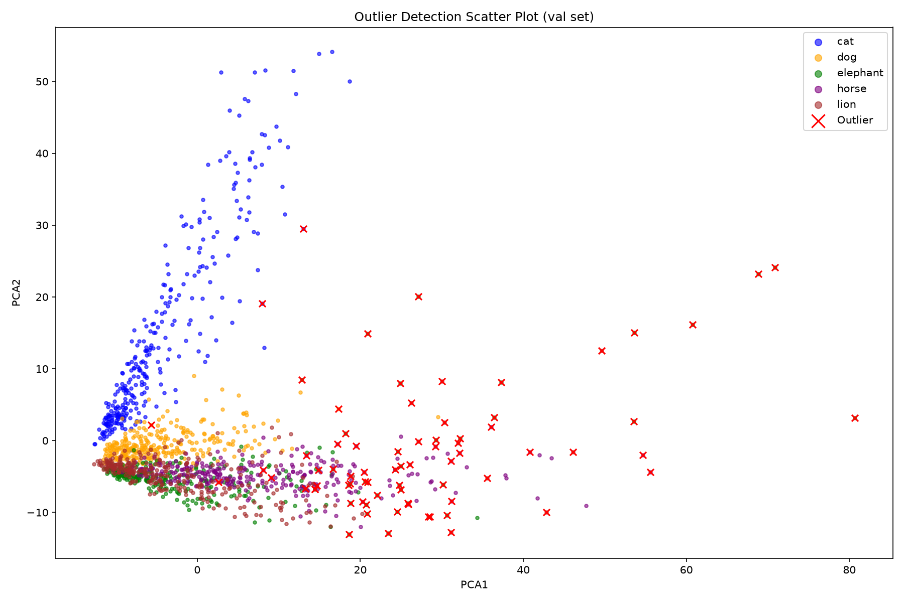
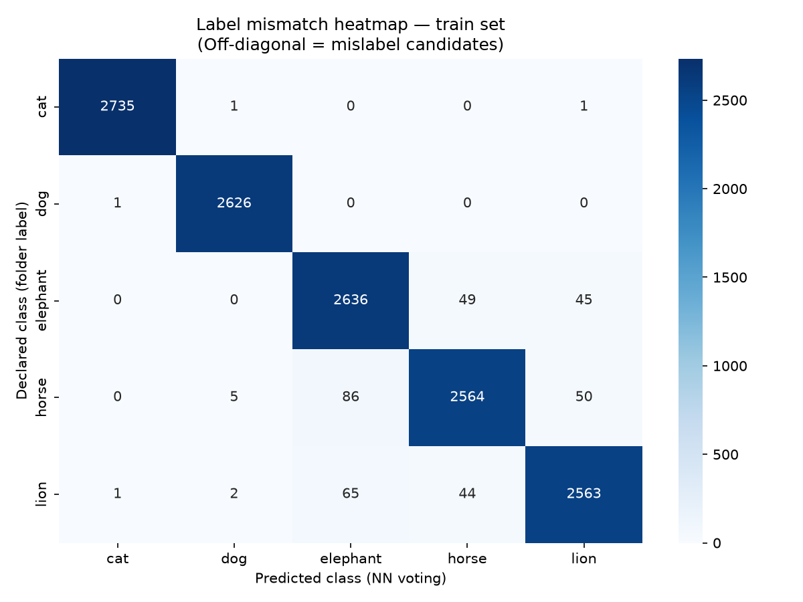
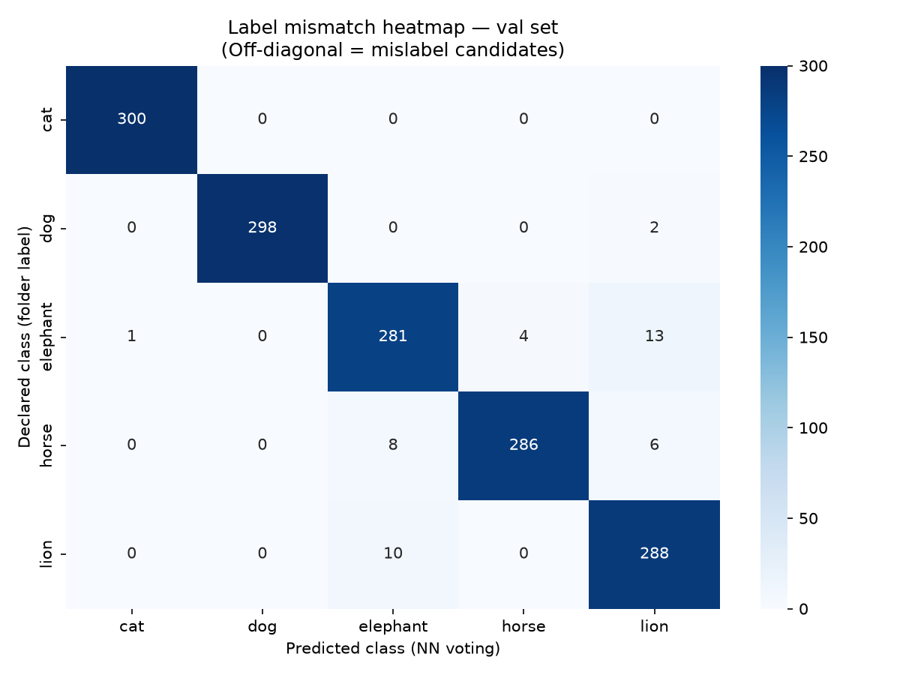

# Intelligent Image Data Cleaning Framework Using Deep Learning

An end-to-end deep learning framework for automatically detecting and removing low-quality images—including duplicates, blurry images, noisy samples, outliers, and mislabeled data—to improve dataset quality for computer vision applications.


## Overview

Large-scale image datasets often contain duplicate images, blurry samples, noisy images, outliers, and incorrect labels. These quality issues reduce model accuracy, increase training time, and introduce unwanted bias into deep learning models.

This project presents an intelligent image data cleaning framework that combines traditional computer vision techniques with deep learning to automatically identify and report poor-quality images before model training.

The framework integrates feature embeddings extracted using ResNet50, perceptual hashing, cosine similarity, Laplacian variance, convolutional autoencoders, and machine learning–based anomaly detection to create a scalable preprocessing pipeline for computer vision datasets.


## Dataset

This project uses the **Animals Image Dataset** from Kaggle for training and evaluation.

- **Dataset:** Animals Image Dataset
- **Source:** [Animals Image Dataset (Kaggle)](https://www.kaggle.com/datasets/antobenedetti/animals/data)
- **Classes:** Cat, Dog, Elephant, Horse, Lion
- **Dataset Structure:**
  ```
  data/raw/Animal/
  ├── train/
  └── val/
  ```

> **Note:** The dataset is not included in this repository due to GitHub's file size limitations. Please download it from Kaggle and place it under the `data/raw/Animal/` directory before running the project.

## Project Pipeline

<p align="center">
  
</p>

## Pipeline Architecture

<p align="center">
  
  </p>


## Key Features

- **Image Validation & Preprocessing**
  - Detects corrupted and unreadable images.
  - Standardizes image format and dimensions using OpenCV and PIL.

- **Feature Embedding Extraction**
  - Extracts 2048-dimensional deep feature embeddings using a pretrained ResNet50 model.
  - Stores embeddings for efficient downstream analysis.

- **Duplicate Detection**
  - Identifies exact duplicate images using Perceptual Hashing (pHash).
  - Detects near-duplicate images using cosine similarity between deep feature embeddings.

- **Blur Detection**
  - Computes the Variance of Laplacian to measure image sharpness.
  - Flags blurry images using a configurable threshold.

- **Noise Detection**
  - Utilizes a Convolutional Autoencoder trained on a clean subset of the dataset.
  - Detects noisy images using reconstruction error (Mean Squared Error).
  - Applies a dynamic threshold (`mean + 2 × standard deviation`) for robust noise classification.

- **Outlier Detection**
  - Identifies visually irrelevant images using Isolation Forest on deep feature embeddings.

- **Mislabel Detection**
  - Detects incorrectly labeled images through embedding-based clustering and class consistency analysis.

- **Decision Engine**
  - Aggregates outputs from all quality modules to generate a final per-image cleaning decision.

- **Interactive Dashboard (Planned)**
  - Streamlit-based interface for visualizing reports and reviewing flagged images.


## Project Structure

```text
image-cleaning-framework/
│
├── assets/                          # Images used in the README
│   ├── project_pipeline.png
│   ├── autoencoder_loss_curve.png
│   ├── reconstruction_sample.png
│   └── architecture.png
│
├── data/
│   └── raw/
│       └── Animal/
│           ├── train/
│           └── val/
│
├── embeddings/                      # ResNet50 feature embeddings (.npy)
│
├── models/                          # Trained deep learning models
│   └── autoencoder.pth
│
├── notebooks/                       # Experimentation and model development
│
├── reports/                         # Generated CSV reports
│   ├── train_duplicates.csv
│   ├── train_blur_report.csv
│   ├── train_noise_report.csv
│   ├── clean_train.csv
│   └── ...
│
├── src/
│   ├── preprocessing.py
│   ├── embeddings.py
│   ├── duplicates.py
│   ├── quality.py
│   ├── prepare_autoencoder_data.py
│   ├── outliers.py
│   ├── mislabel.py
│   └── decision_engine.py
│
├── app.py                           # Streamlit application (planned)
├── requirements.txt
├── README.md
└── LICENSE
```

### Folder Description

| Folder/File | Description |
|--------------|-------------|
| **assets/** | Images and figures used in the project documentation. |
| **data/** | Raw image dataset used for training and evaluation. |
| **embeddings/** | Deep feature embeddings extracted using ResNet50. |
| **models/** | Saved deep learning model weights (Autoencoder). |
| **notebooks/** | Jupyter notebooks for experimentation and prototyping. |
| **reports/** | CSV reports generated by each quality assessment module. |
| **src/** | Source code implementing all image quality detection modules. |
| **app.py** | Streamlit dashboard for interactive visualization *(under development)*. |
| **requirements.txt** | Python package dependencies required to run the project. |


## Technology Stack

| Category | Technologies |
|----------|--------------|
| **Programming Language** | Python |
| **Deep Learning** | PyTorch, TorchVision |
| **Computer Vision** | OpenCV, Pillow **Mislabel Detection**
  - Detects incorrectly labeled images through embedding-based clustering and class consistency analysis.(PIL) |
| **Feature Extraction** | ResNet50 (Pretrained CNN) |
| **Machine Learning** | Scikit-learn (Isolation Forest, Cosine Similarity) |
| **Data Processing** | NumPy, Pandas |
| **Visualization** | Matplotlib |
| **Image Hashing** | ImageHash (Perceptual Hashing) |
| **Web Framework** | Streamlit *(Dashboard - In Progress)* |
| **Development Tools** | Git, GitHub, Jupyter Notebook, Google Colab |

## Framework Modules

### 1) Image Validation & Preprocessing
- Detects corrupted and unreadable image files.
- Validates supported image formats.
- Standardizes image dimensions and color format.
- Generates preprocessing reports for further analysis.

---

### 2) Feature Embedding Extraction
- Uses a pretrained **ResNet50** model to extract 2048-dimensional feature embeddings.
- Stores embeddings for efficient similarity search and downstream quality assessment.
- Eliminates repeated feature extraction by caching embeddings.

---

### 3) Duplicate Detection
- Detects **exact duplicates** using Perceptual Hashing (pHash).
- Identifies **near-duplicate images** using cosine similarity between ResNet50 feature embeddings.
- Generates duplicate reports for dataset cleaning.

---

### 4) Blur Detection
- Measures image sharpness using the **Variance of Laplacian**.
- Flags images with blur scores below a configurable threshold.
- Produces detailed blur statistics for each class.

---

### 5) Noise Detection
- Trains a **Convolutional Autoencoder** on a clean subset of images.
- Computes reconstruction error (Mean Squared Error) for every image.
- Uses a dynamic threshold (`mean + 2 × standard deviation`) to identify noisy samples.
- Exports comprehensive noise detection reports.

---

### 6) Outlier Detection 
- Detects visually irrelevant or anomalous images using Isolation Forest on deep feature embeddings.

---

### 7) Mislabel Detection 
- Identifies potentially mislabeled images through embedding-based similarity analysis and class consistency checks. Ensemble voting(KMeans + KNN + NN).

---

### 8) Decision Engine 
- Aggregates outputs from all quality assessment modules.
- Assigns a final quality status and recommended action for each image.

---

### 9) Streamlit Dashboard *(Planned)*
- Interactive interface for visualizing reports, flagged images, and cleaning recommendations.


## Experimental Results

### Autoencoder Training Loss

The Convolutional Autoencoder was trained for **30 epochs** on a clean subset of the dataset using the **Adam optimizer** and **Mean Squared Error (MSE)** loss. A learning rate scheduler was applied to improve convergence.

<p align="center">
  
</p>

**Training Summary**

| Metric | Value |
|---------|-------|
| Optimizer | Adam |
| Loss Function | Mean Squared Error (MSE) |
| Epochs | 30 |
| Initial Learning Rate | 0.001 |
| Best Training Loss | **0.001215** (Epoch 28) |
| Final Training Loss | **0.001304** |

### Reconstruction Quality

The trained autoencoder successfully reconstructs clean images while suppressing random noise. Images with higher reconstruction error are treated as noisy or anomalous samples.

<p align="center">
  
</p>

## Outlier Detection Results

The framework projects 2048-dimensional ResNet50 embeddings into a lower-dimensional feature space using PCA, followed by Isolation Forest for anomaly detection. The figures below visualize the detected outliers in the training and validation datasets.

### Training Set

<p align="center">
  
</p>

### Validation Set

<p align="center">
  
</p>

## Mislabel Detection Results

### Training Set

<p align="center">
  
</p>

---

### Validation Set

<p align="center">
  
</p>

## Current Progress

| Module | Status |
|---------|--------|
| Image Validation | Completed |
| Feature Embedding Extraction | Completed |
| Duplicate Detection | Completed |
| Blur Detection | Completed |
| Autoencoder Training | Completed |
| Noise Detection | Completed |
| Outlier Detection | Completed|
| Mislabel Detection | Completed |
| Decision Engine | Completed |
| Streamlit Dashboard | Planned |

## Future Improvements
- Learn adaptive issue weights from validation feedback instead of using        manually assigned priorities.
- Deploy an interactive Streamlit dashboard.
- Add support for custom datasets through a web interface.
- Optimize inference for large-scale datasets.


## Author

**Mohammad Salman**

B.Tech, IIT (ISM) Dhanbad

- GitHub: https://github.com/24je0657
- LinkedIn: https://www.linkedin.com/in/salman-mohammad-192ba035b

If you find this project useful, consider giving it a ⭐ on GitHub.