# Intelligent Image Data Cleaning Framework Using Deep Learning

An end-to-end deep learning framework for automatically detecting and removing low-quality images—including duplicates, blurry images, noisy samples, outliers, and mislabeled data—to improve dataset quality for computer vision applications.


## Overview

Large-scale image datasets often contain duplicate images, blurry samples, noisy images, outliers, and incorrect labels. These quality issues reduce model accuracy, increase training time, and introduce unwanted bias into deep learning models.

This project presents an intelligent image data cleaning framework that combines traditional computer vision techniques with deep learning to automatically identify and report poor-quality images before model training.

The framework integrates feature embeddings extracted using ResNet50, perceptual hashing (with BK-tree acceleration), cosine similarity, Laplacian variance, convolutional autoencoders, and machine learning–based anomaly detection to create a scalable preprocessing pipeline for computer vision datasets. A production-ready FastAPI backend exposes all pipeline modules as asynchronous REST endpoints.

This framework combines traditional computer vision techniques, deep learning, and unsupervised machine learning to automatically identify duplicate, blurry, noisy, outlier, and mislabeled images. A weighted Decision Engine aggregates outputs from all quality modules to generate actionable cleaning recommendations, while a Streamlit dashboard provides interactive visualization and dataset inspection.

## Dataset

This project uses the **Animals Image Dataset** from Kaggle for training and evaluation.

- **Dataset:** Animals Image Dataset
- **Source:** [Animals Image Dataset (Kaggle)](https://www.kaggle.com/datasets/antobenedetti/animals/data)
- **Classes:** Cat, Dog, Elephant, Horse, Lion
- **Dataset Structure:**
 <p align="center">
  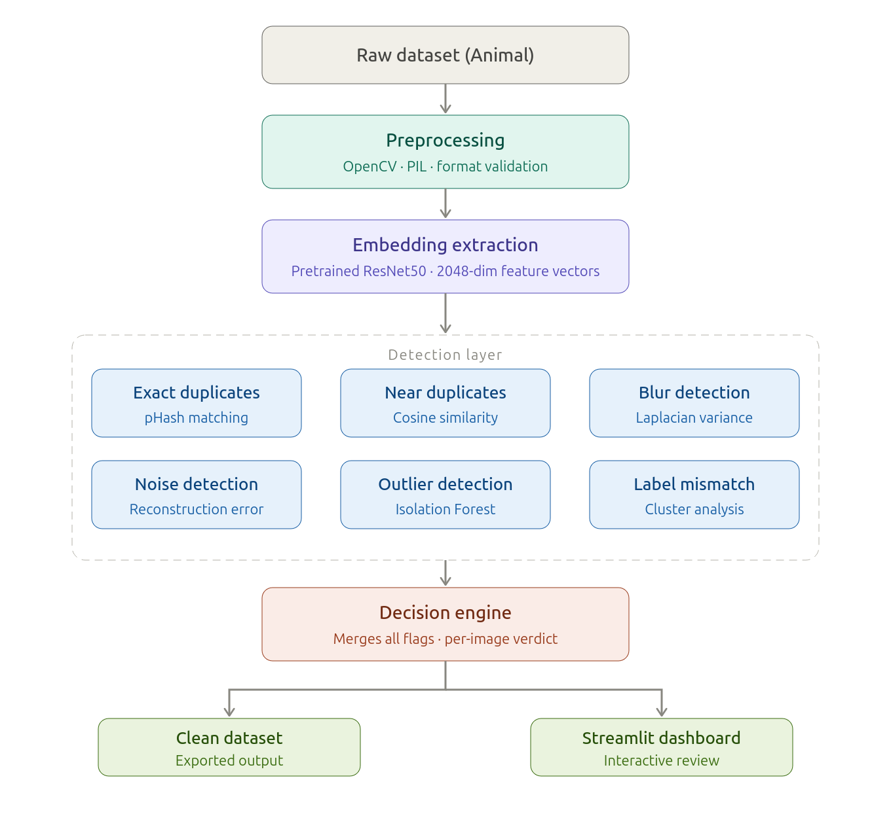
</p>

> **Note:** The dataset is not included in this repository due to GitHub's file size limitations. Please download it from Kaggle and place it under the `data/raw/Animal/` directory before running the project.

### Dataset Finding — Format Anomaly

During preprocessing, the framework detected that 247 out of 300 validation horse images (82.3%) were PNG format, while all other classes were exclusively JPG. This format inconsistency was identified as a potential source of preprocessing and reconstruction inconsistencies.

The framework automatically detected the anomaly and converted the PNG files to JPG (quality=95), with MSE-based verification, using `src/format_converter.py`. Subsequent analysis showed that the format difference was **not the root cause of the higher horse reconstruction-error distribution**.

## Project Pipeline

<p align="center">
  
</p>

## Pipeline Architecture

<p align="center">
  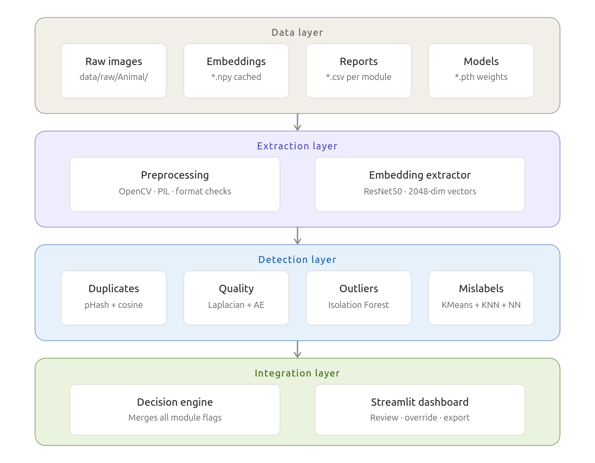
</p>

## Key Features

- **Image Validation & Preprocessing**
  - Detects corrupted and unreadable images.
  - Standardizes image format and dimensions using OpenCV and PIL.
  - Detects and reports format anomalies across classes.

- **Feature Embedding Extraction**
  - Extracts 2048-dimensional deep feature embeddings using a pretrained ResNet50 model.
  - Stores embeddings for efficient downstream analysis.

- **Duplicate Detection**
  - Identifies exact duplicate images using multi-hash perceptual hashing (pHash + dHash + wHash + aHash).
  - Accelerated using a **BK-tree** (O(n log n) vs O(n²) brute force) — ~75× speedup on 13k images.
  - Empirically validated: initial 2-of-4 rule achieved 68% precision (34/50); tightened rule (pHash required + 1 corroborating hash) achieved **100% precision (50/50)** on manual validation.
  - Detects near-duplicate images using cosine similarity with a three-tier confidence band (DEFINITE ≥ 0.99, LIKELY ≥ 0.97, POSSIBLE ≥ 0.93).

- **Blur Detection**
  - Uses Variance of Laplacian as a lightweight image sharpness heuristic.
  - Uses adaptive per-class thresholds derived from the 5th percentile of
    each class's blur-score distribution.
  - Includes a contamination guard to prevent threshold contamination.
  - Documents the limitation that Laplacian variance measures edge content
    rather than directly measuring perceptual blur.

- **Noise Detection**
  - Utilises a Convolutional Autoencoder trained on a clean subset of the dataset.
  - Detects noisy images using reconstruction error (Mean Squared Error).
  - Applies **adaptive per-class dynamic thresholds** (`mean + 2 × standard deviation` per class) for robust noise classification.

- **Outlier Detection**
  - Identifies visually irrelevant images using Isolation Forest on PCA-reduced (2048 → 128 dimensions) deep feature embeddings.
  - Runs both globally (dataset-wide) and per-class to catch class-specific anomalies.

- **Mislabel Detection**
  - Detects potentially mislabeled images using an ensemble of three methods:
    - **DBSCAN clustering** (replaced KMeans — no K to tune, naturally identifies density outliers)
    - **K-Nearest Neighbor voting**
    - **Class centroid distance analysis**
  - Images flagged by 2 or more methods receive MEDIUM or HIGH confidence scores.

- **Decision Engine**
  - Aggregates all module outputs using a **confidence-adjusted weighted scoring** strategy.
  - Weights vary by detection confidence (e.g., HIGH mislabel = 9 vs MEDIUM = 6) rather than flat weights.
  - Classifies every image as CLEAN, REVIEW, or REMOVE with a priority score.

- **Interactive Streamlit Dashboard**
  - 9-tab Streamlit interface covering Home, Overview, Before vs After, Duplicates, Quality, Outliers & Mislabels, Image Inspector, Analytics, and Export.

- **Production FastAPI Backend**
  - Async REST API with routes/services separation.
  - Background job submission with WebSocket real-time progress.
  - Single-image analysis endpoint with file upload support.

## Project Structure

```text
image-cleaning-framework/
│
├── api/                             # Production FastAPI backend
│   ├── main.py                      # App factory — registers all routers
│   ├── schemas.py                   # Pydantic request/response models
│   ├── dependencies.py              # Shared model loading (lru_cache)
│   ├── worker.py                    # Async job management + ThreadPoolExecutor
│   ├── routes/
│   │   ├── health.py
│   │   ├── upload.py
│   │   ├── jobs.py
│   │   └── results.py
│   └── services/
│       ├── pipeline.py
│       ├── duplicate_service.py
│       ├── quality_service.py
│       ├── outlier_service.py
│       ├── mislabel_service.py
│       └── decision_engine.py
│
├── assets/                          # Images used in the README
│   ├── project_pipeline.png
│   ├── architecture.png
│   ├── autoencoder_loss_curve.png
│   └── reconstruction_sample.png
│
├── data/
│   └── raw/
│       └── Animal/
│           ├── train/
│           └── val/
│
├── embeddings/                      # ResNet50 feature embeddings (.npy)
│
├── models/                          # Trained deep learning models
│   └── autoencoder.pth
│
├── notebooks/                       # Experimentation and validation scripts
│
├── reports/                         # Generated CSV reports per module
│
├── src/
│   ├── preprocessing.py             # Format validation + anomaly detection
│   ├── embeddings.py                # ResNet50 feature extraction
│   ├── duplicates.py                # BK-tree + multi-hash duplicate detection
│   ├── quality.py                   # Adaptive blur + noise detection
│   ├── format_converter.py          # PNG → JPG format normalisation
│   ├── prepare_autoencoder_data.py  # Clean subset CSV for autoencoder training
│   ├── outliers.py                  # PCA + Isolation Forest outlier detection
│   ├── mislabel.py                  # DBSCAN + KNN + centroid mislabel detection
│   └── decision_engine.py          # Confidence-adjusted master report
│
├── app.py                           # Streamlit dashboard (9 tabs)
├── run_pipeline.py                  # Master script — runs all 9 steps
├── run_api.py                       # FastAPI entry point (uvicorn)
├── requirements.txt
├── README.md
└── LICENSE
```

### Folder Description

| Folder/File | Description |
|--------------|-------------|
| **api/** | Production FastAPI backend with routes/services separation. |
| **assets/** | Images and figures used in the project documentation. |
| **data/** | Raw image dataset used for training and evaluation. |
| **embeddings/** | Deep feature embeddings extracted using ResNet50. |
| **models/** | Saved deep learning model weights (Autoencoder). |
| **notebooks/** | Validation scripts and diagnostic notebooks. |
| **reports/** | CSV reports generated by each quality assessment module. |
| **src/** | Source code implementing all image quality detection modules. |
| **app.py** | Streamlit dashboard for interactive visualization (9 tabs). |
| **run_pipeline.py** | Master script — single command runs all 9 pipeline steps. |
| **run_api.py** | FastAPI production backend entry point. |
| **requirements.txt** | Python package dependencies required to run the project. |

## Technology Stack

| Category | Technologies |
|----------|--------------|
| **Programming Language** | Python 3.10 |
| **Deep Learning** | PyTorch, TorchVision |
| **Computer Vision** | OpenCV, Pillow |
| **Feature Extraction** | ResNet50 (Pretrained CNN) |
| **Machine Learning** | Scikit-learn (PCA, DBSCAN, KNN, Isolation Forest, Cosine Similarity) |
| **Data Processing** | NumPy, Pandas |
| **Image Hashing** | ImageHash (pHash, dHash, wHash, aHash), pybktree |
| **Visualization** | Matplotlib, Plotly, Seaborn |
| **Web Framework** | Streamlit (dashboard), FastAPI (production API) |
| **API Server** | Uvicorn, Pydantic |
| **Development Tools** | Git, GitHub, Jupyter Notebook, Google Colab |

## Framework Modules

### 1) Image Validation & Preprocessing

- Detects corrupted and unreadable image files.
- Validates supported image formats.
- Standardizes image dimensions and color format.
- Detects format distribution anomalies per class (e.g., PNG vs JPG imbalance).
- Generates preprocessing reports for further analysis.

---

### 2) Feature Embedding Extraction

- Uses a pretrained **ResNet50** model to extract 2048-dimensional feature embeddings.
- Removes the final classification head — retains the global average pooling output.
- Stores embeddings as `.npy` files for efficient reuse across all downstream modules.
- Embeddings are shared by duplicate detection, outlier detection, and mislabel detection.

---

### 3) Duplicate Detection

- Detects **exact duplicates** using multi-hash perceptual hashing (pHash + dHash + wHash + aHash).
- **BK-tree indexing** reduces candidate search from O(n²) to O(n log n) — ~75× speedup on 13k images.
- **Empirically validated matching rule:** pHash must match (strongest signal) plus at least one corroborating hash. Initial 2-of-4 rule achieved 68% precision (34/50 manual pairs). Tightened rule achieved **100% precision (50/50)**.
- Identifies **near-duplicate images** using cosine similarity with three-tier confidence bands.
- Generates duplicate reports with cosine scores and confidence tiers for each flagged pair.

---

### 4) Blur Detection

- Measures image sharpness using the **Variance of Laplacian**.
- **Two-pass adaptive thresholding:**
  - Pass 1 collects all blur scores per class.
  - Pass 2 applies a **contamination guard**: if estimated blur rate exceeds 30% using the global threshold, the class falls back to the global value to avoid threshold contamination.
  - Otherwise, per-class threshold is set at the **5th percentile** of the class blur distribution.
- Flags images whose blur score falls below the class-specific threshold.

#### Adaptive Blur Thresholds (Training Set)

| Class | Adaptive Threshold |
|--------|-------------------:|
| Cat | 94.7 |
| Dog | 65.8 |
| Elephant | 747.8 |
| Horse | 192.6 |
| Lion | 535.4 |

> The 11× difference between Dog (65.8) and Elephant (747.8) reflects genuine differences in natural image texture — elephant skin produces far higher Laplacian variance than smooth dog coats. A single global threshold would either miss blurry elephant images or over-flag sharp dog images.


#### Blur Detection Limitation

The framework uses **Variance of Laplacian** as a lightweight sharpness
heuristic. This metric measures high-frequency edge variation rather than
human-perceived blur.

During visual validation on the Animals Image Dataset, approximately
**99 Cat/Dog training images (~1.8% of the combined Cat/Dog training set)**
were identified as blur-only detections that appeared visually acceptable
during manual inspection. These images generally exhibited low edge content,
smooth subject regions, or relatively plain backgrounds rather than obvious
optical blur.

This demonstrates an important limitation of Laplacian-variance-based blur
detection:

- Low Laplacian variance can indicate genuine blur.
- Low Laplacian variance can also occur in visually acceptable,
  low-texture images.
- Therefore, the detector should be interpreted as a **sharpness heuristic**,
  not a direct measurement of perceptual image quality.

The current lightweight detector is retained for computational efficiency,
and this limitation is explicitly documented rather than compensated for by
arbitrarily changing the class-specific thresholds.

**Potential future improvements:** BRISQUE, NIQE, or a learned
blur-quality classifier could be incorporated as a secondary perceptual
quality check.

---

#### 5) Noise Detection

- Trains a **Convolutional Autoencoder** on a clean subset of images identified through a CSV manifest.
- Computes reconstruction error (Mean Squared Error) for every image.
- Uses **adaptive per-class dynamic thresholds** (`mean + 2 × standard deviation`) rather than relying only on a global threshold.
- Images exceeding their class-specific reconstruction-error threshold are initially flagged as potentially noisy.
- A **noise refinement stage** further analyzes initially flagged images to distinguish likely noise from visually unusual or potentially out-of-distribution samples.
- Each initially flagged image receives one of the following verdicts:
  - `confirmed_noisy`
  - `review_noise`
  - `review_possible_ood`
  - `not_flagged`
- The refined noise signal (`is_noisy_refined`) is used by the Decision Engine for final quality scoring.
- This refinement substantially reduces false noise flags caused by legitimate but visually unusual images.

#### Noise Refinement Results

| Split | Initially Flagged | Refined Noisy | Possible OOD | Review Noise | Confirmed Noisy |
|-------|------------------:|--------------:|-------------:|-------------:|----------------:|
| Train | 635 | **19** | 616 | 11 | 8 |
| Validation | 54 | **9** | 45 | 4 | 5 |

The refinement stage reduced the final noise signal from **635 to 19 images in the training set** and from **54 to 9 images in the validation set**, while retaining potentially unusual samples as `review_possible_ood` instead of automatically classifying them as noisy.

---

### 6) Format Normalisation

- Scans the full dataset for format distribution anomalies across all classes and splits.
- Detected that 247/300 (82.3%) of validation horse images were PNG while all other classes were JPG.
- Converts non-JPG images to JPG (quality=95) with MSE-based verification before removing originals.
- Confirmed PNG format was not the root cause of high horse noise rate — horse images have genuinely higher reconstruction error due to greater visual diversity.

---

### 7) Outlier Detection

- Projects 2048-dimensional ResNet50 embeddings to 128 dimensions using PCA.
- Runs **Isolation Forest** both globally (dataset-wide) and per-class.
- Per-class detection catches class-specific anomalies (e.g., cartoons mixed into a photo class).
- Combined flag: image is flagged if either global or per-class Isolation Forest marks it anomalous.

---

### 8) Mislabel Detection

- Identifies potentially mislabeled images through embedding-based ensemble analysis.
- Uses three methods operating in the same PCA-reduced embedding space (128 dimensions):
  - **DBSCAN clustering** — no K to tune; images not belonging to any dense cluster are naturally suspicious.
  - **K-Nearest Neighbor voting** — images where fewer than 40% of neighbors share their declared class are flagged.
  - **Class centroid distance analysis** — images closer to a different class centroid than their own are flagged.
- Images flagged by ≥ 2 methods are classified as MEDIUM (2/3) or HIGH (3/3) confidence mislabels.

---

### 9) Decision Engine

- Aggregates outputs from all detection modules using a **confidence-adjusted weighted scoring** strategy.
- Uses the refined noise signal .
- Weights vary by detection confidence rather than using flat per-flag weights:
  - HIGH mislabel confidence → weight 9; MEDIUM → 6; LOW → 3
  - Severe blur (score < 20) → weight 8; moderate blur → 5
  - DEFINITE near-duplicate → weight 10; LIKELY → 7; POSSIBLE → 4
- Classifies every image as CLEAN, REVIEW, or REMOVE with a priority score.
- Generates a master report combining all module flags per image.

---

### 10) Production FastAPI Backend

- Full REST API with routes/services architecture separation.
- Models loaded once at startup via `lru_cache` — never reloaded per request.
- CPU-bound tasks (ResNet50 inference, OpenCV, sklearn) run in `ThreadPoolExecutor` — never block the event loop.
- **Endpoints:**
  - `POST /pipeline/run` — submit full pipeline as async background job, returns `job_id` immediately.
  - `GET /jobs/{job_id}` — poll job status and progress.
  - `WS /ws/{job_id}` — WebSocket real-time progress updates.
  - `POST /analyze/image` — analyze a single image by path.
  - `POST /analyze/upload` — upload and analyze an image directly.
  - `GET /stats/{split}` — cleaning summary from precomputed report.
  - `GET /reports/{split}/{type}` — download any CSV report.
  - `GET /health` — API health check with model status.
- Interactive Swagger docs at `http://localhost:8000/docs`.

---

### 11) Streamlit Dashboard

- Interactive 9-tab interface for exploring dataset quality.
- **Tabs:** Home · Overview · Before vs After · Duplicates · Quality · Outliers & Mislabels · Image Inspector · Analytics · Export.
- Features: framework performance bar, color-coded DataFrames, per-class progress bars, confidence gauges, outlier scatter plots, mislabel heatmaps, image inspector with per-flag breakdown, and export with configurable removal rules.

## Experimental Results

### Duplicate Detection Validation

| Version | Rule | Manual Precision |
|---------|------|-----------------|
| v1 | Any 2-of-4 hashes match, threshold=5 | 68% (34/50 pairs) |
| v2 | pHash required + 1 corroborating hash, threshold=4 | **100% (50/50 pairs)** |
| v3 (current) | v2 rule + BK-tree acceleration + cosine verification | **100% + ~75× faster** |

---

### Autoencoder Training Loss

The Convolutional Autoencoder was trained for **30 epochs** on a clean subset of the dataset using the **Adam optimizer** and **Mean Squared Error (MSE)** loss. A learning rate scheduler was applied to improve convergence.

<p align="center">
  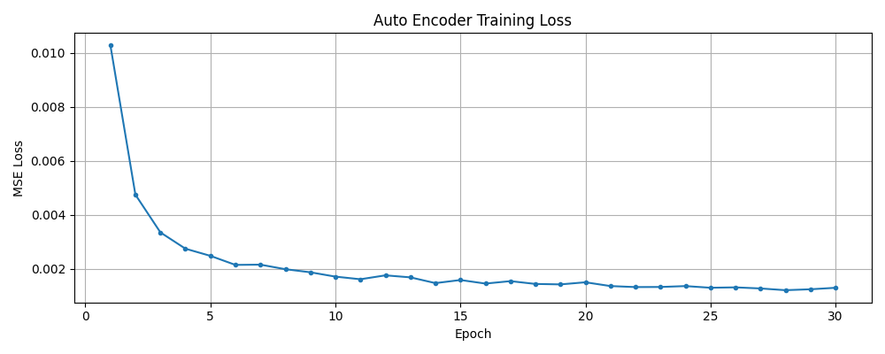
</p>

**Training Summary**

| Metric | Value |
|---------|-------|
| Optimizer | Adam |
| Loss Function | Mean Squared Error (MSE) |
| Epochs | 30 |
| Initial Learning Rate | 0.001 |
| Best Training Loss | **0.001215** (Epoch 28) |
| Final Training Loss | **0.001304** |

### Reconstruction Quality

The trained autoencoder successfully reconstructs clean images while producing high reconstruction error for noisy or anomalous samples.

<p align="center">
  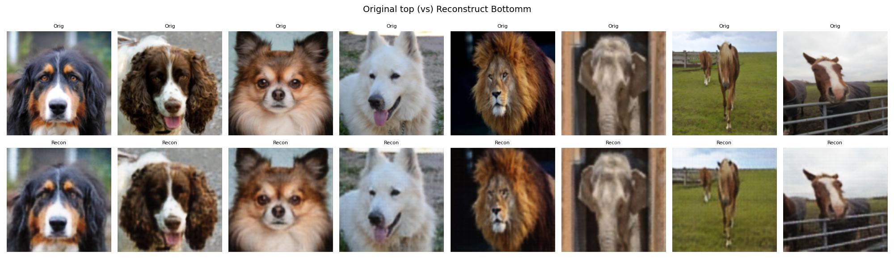
</p>

## Outlier Detection Results

The framework projects 2048-dimensional ResNet50 embeddings into a lower-dimensional feature space using PCA, followed by Isolation Forest for anomaly detection.

### Training Set

<p align="center">
  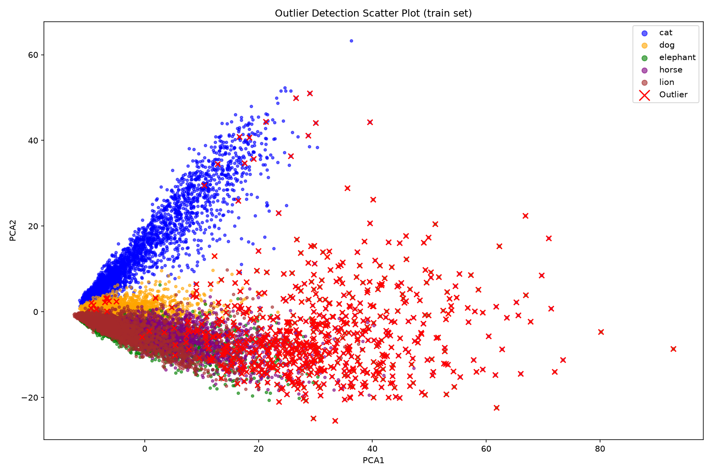
</p>

### Validation Set

<p align="center">
  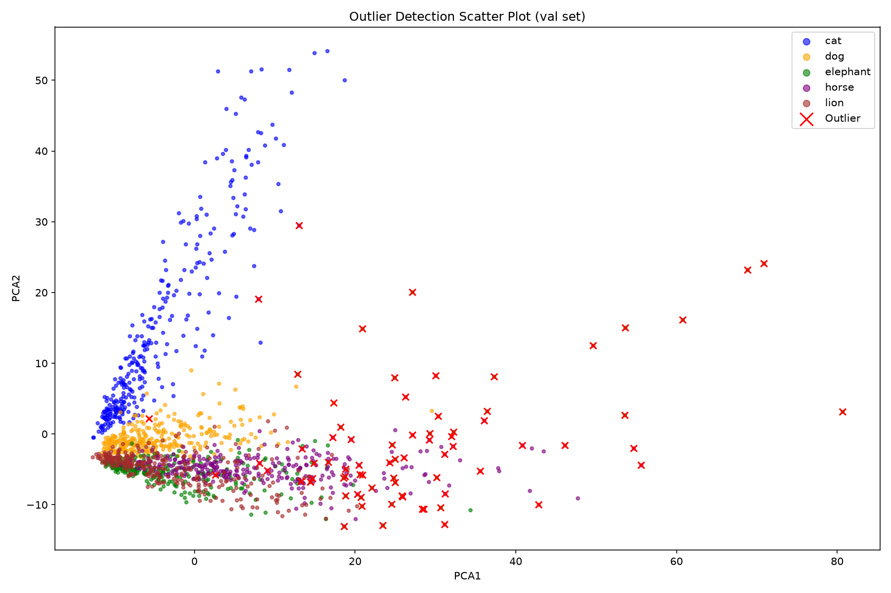
</p>

## Mislabel Detection Results

### Training Set

<p align="center">
  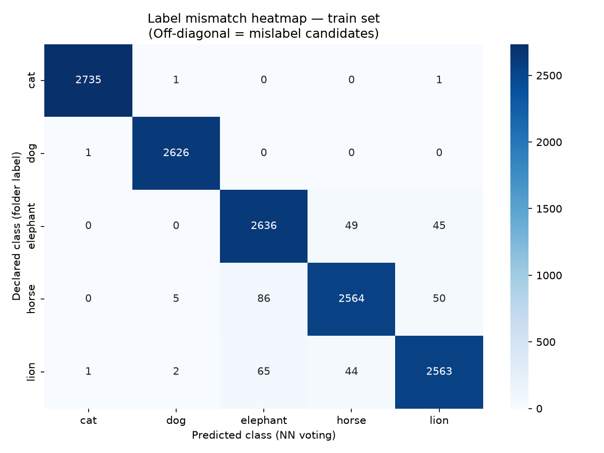
</p>

### Validation Set

<p align="center">
  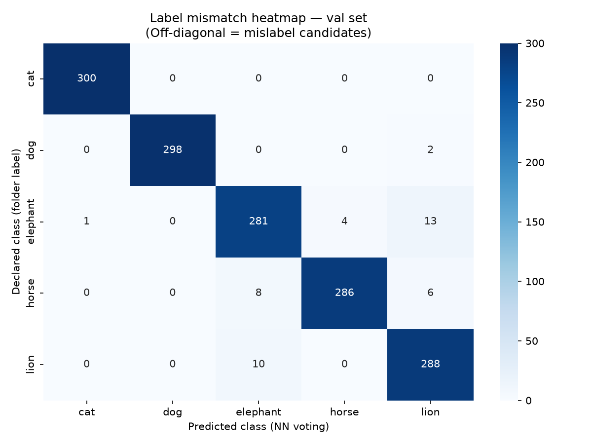
</p>

### Mislabel Detection — Empirical Validation

**Manual precision validation on HIGH-confidence flags:**

| Split | Reviewed | Confirmed | False Positives | Precision |
|-------|--------:|----------:|----------------:|----------:|
| Train | 20 | 20 | 0 | **100%** |
| Val   | 17 | 17 | 0 | **100%** |
| **Total** | **37** | **37** | **0** | **100%** |

Every HIGH-confidence mislabel (3/3 methods agree) was
manually verified as a genuine labeling error.

**Confirmed confusion pairs (train):**

| Declared → Predicted | Count | Confirmed |
|---------------------|------:|----------:|
| lion → elephant | 6 | 6 |
| lion → horse | 5 | 5 |
| elephant → horse | 3 | 3 |
| horse → dog | 2 | 2 |
| horse → lion | 1 | 1 |
| horse → elephant | 1 | 1 |
| elephant → lion | 1 | 1 |
| lion → dog | 1 | 1 |

**Key finding:** Lion images are the most commonly mislabeled
class — frequently confused with elephant (6 cases) and horse
(5 cases), consistent with shared savanna backgrounds and
similar body proportions in certain photography angles.

## Cleaning Results

### Training Set (13,474 images)

| Issue Type | Count | Percentage |
|------------|------:|----------:|
| Exact duplicates | 408 | 3.03% |
| Near duplicates | 527 | 3.91% |
| Blurry images | 676 | 5.02% |
| Noisy images | 635 | 4.71% |
| Outliers | 951 | 7.06% |
| Mislabeled | 174 | 1.29% |
| **To REMOVE** | **627** | **4.65%** |
| **To REVIEW** | **1,748** | **12.97%** |
| **Clean** | **11,099** | **82.38%** |

### Validation Set (1,497 images)

| Issue Type | Count | Percentage |
|------------|------:|----------:|
| Exact duplicates | 1 | 0.07% |
| Near duplicates | 11 | 0.73% |
| Blurry images | 75 | 5.01% |
| Noisy images | 9 | 0.60% |
| Outliers | 132 | 8.82% |
| Mislabeled | 60 | 4.01% |
| **To REMOVE** | **66** | **4.41%** |
| **To REVIEW** | **171** | **11.42%** |
| **Clean** | **1,260** | **84.17%** |

### Key Dataset Findings

- **Dog class** has the lowest natural sharpness baseline (blur threshold 65.8 vs elephant 747.8) — consistent with motion blur from fast-moving subjects.
- **Noise refinement:** The Autoencoder initially flagged 635 training images and 54 validation images. After refinement, only 19 training images and 9 validation images were classified as refined noisy samples, while the majority of initial flags were categorized as possible OOD cases.
- **Val/horse format anomaly:** 247/300 validation horse images were PNG while all other classes were JPG; the anomaly was detected and corrected automatically by the framework. Subsequent analysis showed that the format difference was not the root cause of the higher horse reconstruction-error distribution.
- **Elephant class** has the highest mislabel rate (train 2.1%, val 9.0%) — consistent with visual similarity to lion in savanna backgrounds.
- **Val/horse format anomaly** — 247/300 images were PNG vs JPG for all other classes; detected and corrected automatically by the framework.

## Interactive Streamlit Dashboard

### Home

Provides an overview of the framework, technology stack, dataset statistics, and the complete image cleaning workflow.

<p align="center">
  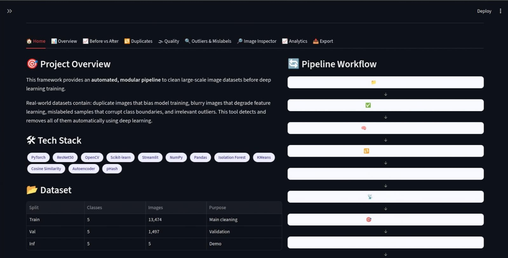
</p>

---

### Decision Engine Overview

Displays the final cleaning decisions, issue distribution, and dataset quality statistics after combining all detection modules.

<p align="center">
  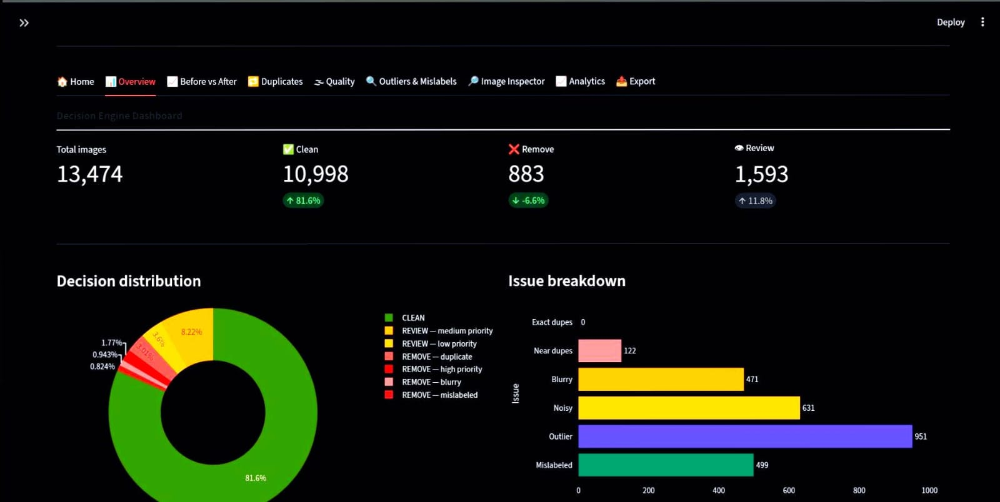
</p>

---

### Duplicate Detection

Visualizes exact and near-duplicate image pairs detected using multi-hash perceptual hashing and cosine similarity.

<p align="center">
  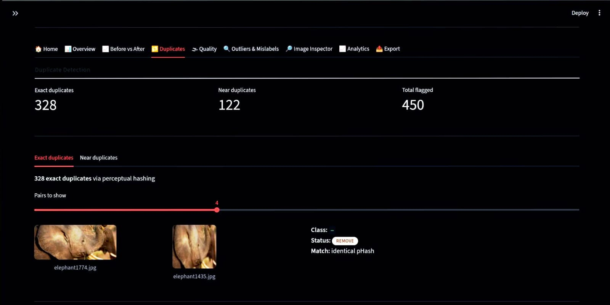
</p>

---

### Analytics Dashboard

Provides dataset cleaning efficiency, per-class issue statistics, module execution summary, and overall data quality metrics.

<p align="center">
  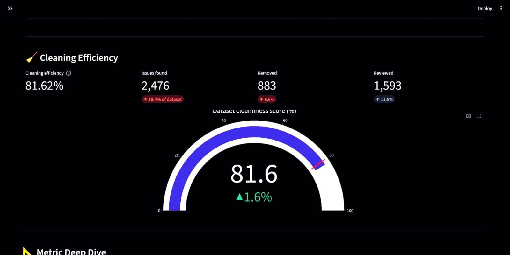
</p>

## Quick Start

### 1. Install dependencies

```bash
pip install -r requirements.txt
```

### 2. Place dataset

Download the Animals dataset from Kaggle and place it under `data/raw/Animal/`.

### 3. Run full pipeline

```bash
# Run all 9 steps for both splits
python run_pipeline.py --split both --skip-embeddings

# Run train only
python run_pipeline.py --split train

# Run from scratch (re-extracts embeddings)
python run_pipeline.py --split both
```
The master pipeline executes the modules in dependency order:

1. Format distribution scan
2. Image validation
3. ResNet50 embedding extraction
4. Duplicate detection
5. Adaptive blur detection
6. Adaptive noise detection and refinement
7. Outlier detection
8. Mislabel detection
9. Decision Engine

### 4. Launch dashboard

```bash
streamlit run app.py
```

### 5. Start production API

```bash
python run_api.py
# API docs at http://localhost:8000/docs
```

## Current Progress

| Module | Status |
|---------|--------|
| Image Validation | ✅ |
| Format Normalisation | ✅ |
| Feature Embedding Extraction | ✅ |
| Duplicate Detection (BK-tree, empirically validated) | ✅ |
| Blur Detection (adaptive per-class) | ✅ |
| Autoencoder Training | ✅ |
| Noise Detection (adaptive per-class) | ✅ |
| Outlier Detection | ✅ |
| Mislabel Detection (DBSCAN ensemble) | ✅ |
| Decision Engine (confidence-adjusted) | ✅ |
| Master Pipeline Script | ✅ |
| Streamlit Dashboard (9 tabs) | ✅ |
| FastAPI Production Backend | ✅ |

## Future Improvements

- Support multi-class custom datasets beyond the current 5-class animal dataset.
- Add active learning for automatic relabeling of HIGH-confidence mislabels.
- Learn Decision Engine weights automatically from human-reviewed ground truth.
- Support distributed processing for datasets exceeding 100k images.
- Integrate CLIP embeddings for stronger semantic similarity across domains.
- Add Docker support for one-command deployment.

## Author

**Mohammad Salman**
B.Tech, IIT (ISM) Dhanbad

- GitHub: https://github.com/24je0657
- LinkedIn: https://www.linkedin.com/in/salman-mohammad-192ba035b

If you find this project useful, consider giving it a ⭐ on GitHub.